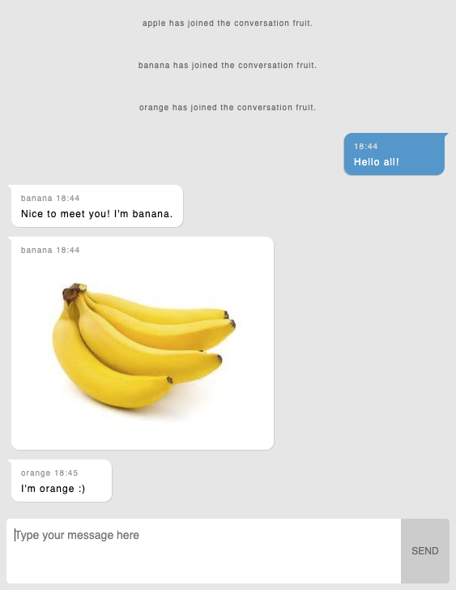

# cslobby
A simple online chat lobby.



Dependencies:
- [python-websocket-server](https://github.com/Pithikos/python-websocket-server) (Already included in the folder `py`)

# Usage
You can launch the server by running:
```
python server.py
```
Then open `client.html` in your browser.


## Supported URL parameters
All the users will chat with others anonymously in the public channel, unless following parameters are defined.

| Parameter | Explanation                               | Example                                 |
|-----------|-------------------------------------------|-----------------------------------------|
| nickname  | To use your nickname to chat with others. | `.../client.html?nickname=sihang`       |
| channel   | To chat in a specific channel.            | `.../client.html?channel=amsterdamtour` |

For example, if you want to chat as *Jan* in a channel named *crowdsourcing*, you can enter the url as following:
```
.../client.html?nickname=Jan&channel=crowdsourcing
```

## Deploy cslobby to the server
Find the line `server = WebsocketServer(5000, host='0.0.0.0')` from `server.py`. The first parameter represents `Port` and the second parameter represents `IP Address`.

Find the line `var ws = new WebSocket("ws://localhost:5000");` from `client.js`. Replace `localhost:5000` by the IP of your server and the port you defined in `server.py`.
